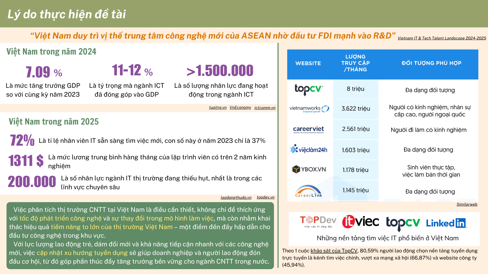
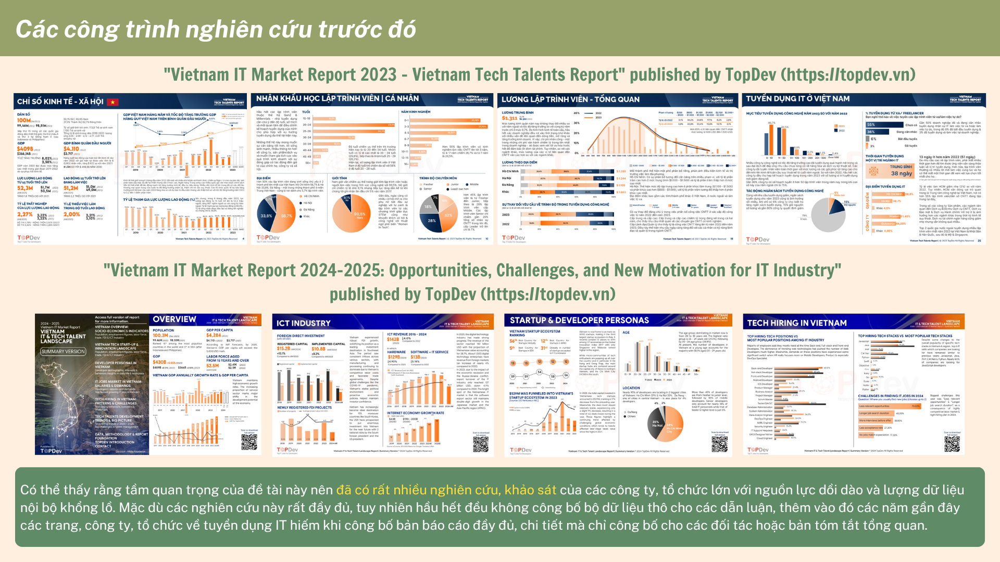

# DS108 - Tiền Xử Lý Và Xây Dựng Bộ Dữ Liệu





Xem chi tiết tại Slide_Report_Final_Project.pdf
## 🌳 Cây thư mục cho dự án

```
it-job-trend-analyzer/
│
├── 📁 data/                       # Lưu trữ dữ liệu raw và processed
│   ├── raw_html/                 # HTML cào được từ các trang tuyển dụng (Giai đoạn 1)
│   ├── scraped_data/            # Dữ liệu JSON/CSV sau khi scrape (Giai đoạn 2)
│   └── standardized_data/       # Dữ liệu đã chuẩn hóa từ LLM (Giai đoạn 3)
│
├── 📁 notebooks/                 # Notebook Jupyter cho EDA, prototyping
│   ├── eda.ipynb
│   └── llm_data_cleaning.ipynb
│
├── 📁 src/                       # Source code chính
│   ├── crawling/                # Giai đoạn 1: Cào dữ liệu HTML
│   │   └── crawl_jobs.ipynb
│   ├── scraping/                # Giai đoạn 2: Trích xuất thông tin
│   │   └── scrape_info.ipynb
│   ├── preprocessing/           # Giai đoạn 3: Chuẩn hóa bằng LLM
│   │   └── standardize_llm.ipynb
│   ├── recommender/             # Module đề xuất công việc dựa vào CV
│   │   ├── job_matcher.ipynb
│   │   └── resume_parser.ipynb
│   └── utils/                   # Hàm dùng chung
│       └── logger.ipynb
│
├── 📁 models/                    # Lưu các mô hình đã huấn luyện hoặc checkpoint
│   └── job_matching_model.pkl
│
├── 📁 cv_samples/                # Một số CV mẫu để test
│   └── cv1.pdf
│
├── 📁 config/                    # File config cho pipeline hoặc model
│   └── settings.yaml
│
├── 📁 tests/                     # Unit tests
│   └── test_scraper.ipynb
│
├── requirements.txt             # Các thư viện cần thiết
├── README.md                    # Giới thiệu dự án
└── .gitignore                   # Bỏ qua file không cần track
```
