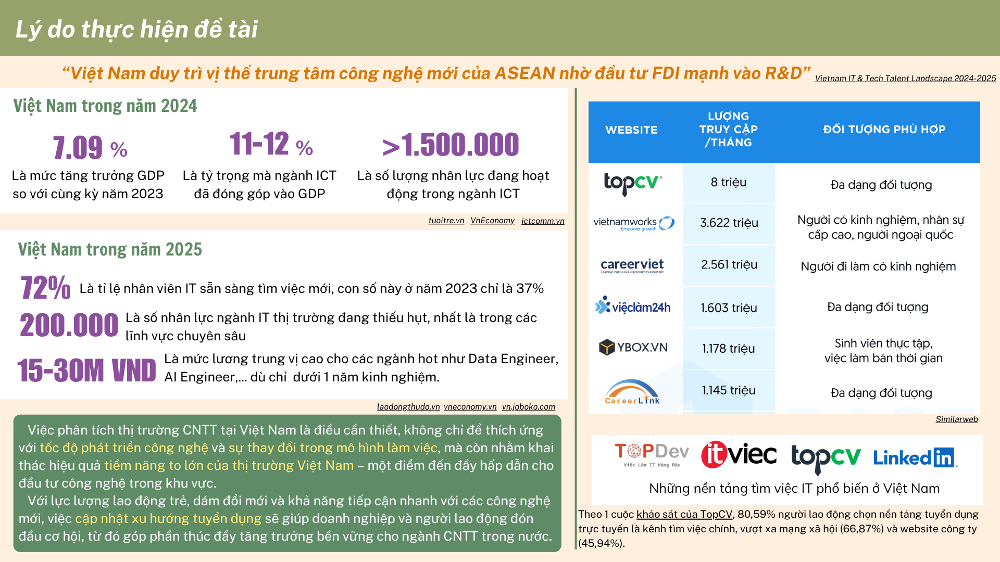
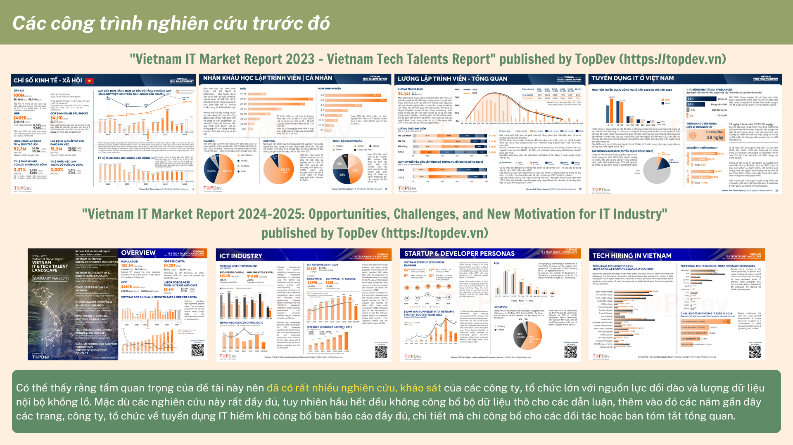

# DS108 - Tiền Xử Lý Và Xây Dựng Bộ Dữ Liệu





Xem chi tiết tại Slide_Report_Final_Project.pdf
## 🌳 Cây thư mục cho dự án

```
it-job-trend-analyzer/
│
├── 📁 data/                       # Lưu trữ dữ liệu raw và processed
│   ├── raw_html/                 # HTML cào được từ các trang tuyển dụng (Giai đoạn 1)
│   ├── scraped_data/            # Dữ liệu JSON/CSV sau khi scrape (Giai đoạn 2)
│   └── standardized_data/       # Dữ liệu đã chuẩn hóa (1NF, 3NF, Star Schema)
│
├── 📁 src/                       # Source code chính
│   ├── analysis_data/           # Phân tích dữ liệu, trực quan hóa bằng PowerBI & xử lý SQL
│   │   ├── powerBI_visualization/
│   │   └── sql_sever_pre_processing/
│   ├── crawling/                # Giai đoạn 1: Cào dữ liệu HTML
│   ├── scraping/                # Giai đoạn 2: Trích xuất thông tin từ HTML
│   ├── preprocessing/           # Giai đoạn 3: Chuẩn hóa dữ liệu bằng API LLM và tiến hành tạo Sliver data 
│   └── recommender/             # Module đề xuất việc làm từ CV
│       ├── ETL_pipeline/
│       ├── backend/
│       └── frontend/
│
├── 📁 cv_samples/                # Một số CV mẫu để test hệ thống (ẩn nội dung chi tiết)
│
├── README.md                    # Giới thiệu dự án
├── Slide_Report_Final_Project.pdf # Slide báo cáo tổng kết

```
